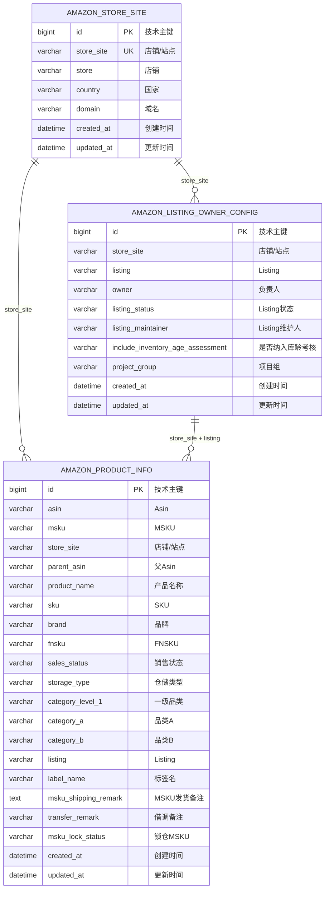

# Amazon 产品信息管理数据库设计

## 1. 设计边界

本设计基于当前已确认的业务规则：
1. 使用 PolarDB MySQL 8.0。
2. 字段命名采用英文小写 + 下划线。
3. 第一版设计 3 张表：
   - `amazon_store_site`
   - `amazon_product_info`
   - `amazon_listing_owner_config`
4. 不引入 `store_site_id`，三张表通过 `store_site` 做逻辑关联。
5. 产品信息表业务唯一键：`store_site + msku`。
6.  Listing 负责人配置表业务唯一键：`store_site + listing`。
7.  店铺站点表业务唯一键：`store_site`。

---

## 2. ER 图



---

## 3. 表关系说明

| 关系 | 关联字段 | 说明 |
|---|---|---|
| `amazon_store_site` → `amazon_product_info` | `store_site` | 一个店铺/站点可以对应多个产品 MSKU |
| `amazon_store_site` → `amazon_listing_owner_config` | `store_site` | 一个店铺/站点可以对应多个 Listing 配置 |
| `amazon_listing_owner_config` → `amazon_product_info` | `store_site + listing` | 一个 Listing 配置可以对应多个产品 MSKU |

说明：第一版暂时不使用数据库外键，只使用字段做逻辑关联。

---

## 4. 数据字典

### 4.1 `amazon_store_site`：Amazon 店铺站点表

一行代表一个店铺/站点。

业务唯一键：`store_site`

| 字段名 | 类型 | 是否为空 | 键 | 中文含义 | 说明 |
|---|---|---|---|---|---|
| `id` | `BIGINT UNSIGNED` | 否 | PK | 技术主键 | 自增主键 |
| `store_site` | `VARCHAR(50)` | 否 | UK | 店铺/站点 | 例如 `SAYOLA:US` |
| `store` | `VARCHAR(50)` | 是 | IDX | 店铺 | 来自负责人参数表原始字段 |
| `country` | `VARCHAR(10)` | 是 | IDX | 国家 | 例如 `US`、`CA`、`JP` |
| `domain` | `VARCHAR(50)` | 是 |  | 域名 | Amazon 站点域名 |
| `created_at` | `DATETIME` | 否 |  | 创建时间 | 系统字段 |
| `updated_at` | `DATETIME` | 否 |  | 更新时间 | 系统字段 |

索引：

| 索引名 | 字段 | 类型 |
|---|---|---|
| `PRIMARY` | `id` | 主键 |
| `uk_store_site` | `store_site` | 唯一索引 |
| `idx_store` | `store` | 普通索引 |
| `idx_country` | `country` | 普通索引 |

---

### 4.2 `amazon_product_info`：Amazon 产品信息表

一行代表一个店铺/站点下的一个 MSKU。

业务唯一键：`store_site + msku`

| 字段名 | 类型 | 是否为空 | 键 | 中文含义 | 说明 |
|---|---|---|---|---|---|
| `id` | `BIGINT UNSIGNED` | 否 | PK | 技术主键 | 自增主键 |
| `asin` | `VARCHAR(20)` | 是 | IDX | Asin | Amazon ASIN |
| `msku` | `VARCHAR(100)` | 否 | UK | MSKU | Amazon MSKU |
| `store_site` | `VARCHAR(50)` | 否 | UK | 店铺/站点 | 与 `amazon_store_site.store_site` 逻辑关联 |
| `parent_asin` | `VARCHAR(20)` | 是 |  | 父Asin | 父 ASIN |
| `product_name` | `VARCHAR(100)` | 是 |  | 产品名称 | 原始产品名称 |
| `sku` | `VARCHAR(100)` | 是 | IDX | SKU | 原始 SKU |
| `brand` | `VARCHAR(50)` | 是 |  | 品牌 | 品牌 |
| `fnsku` | `VARCHAR(30)` | 是 | IDX | FNSKU | Amazon FNSKU |
| `sales_status` | `VARCHAR(20)` | 是 |  | 销售状态 | 例如在售、停售等 |
| `storage_type` | `VARCHAR(50)` | 是 |  | 仓储类型 | 原始仓储类型 |
| `category_level_1` | `VARCHAR(100)` | 是 |  | 一级品类 | 原始一级品类 |
| `category_a` | `VARCHAR(50)` | 是 |  | 品类A | 原始品类A |
| `category_b` | `VARCHAR(100)` | 是 |  | 品类B | 原始品类B |
| `listing` | `VARCHAR(100)` | 是 | IDX | Listing | 与负责人配置表按 `store_site + listing` 逻辑关联 |
| `label_name` | `TEXT` | 是 |  | 标签名 | 原始标签名 |
| `msku_shipping_remark` | `TEXT` | 是 |  | MSKU发货备注 | 原始发货备注 |
| `transfer_remark` | `VARCHAR(500)` | 是 |  | 借调备注 | 原始借调备注 |
| `msku_lock_status` | `VARCHAR(10)` | 是 |  | 锁仓MSKU | 原始字段 `锁仓MKSU` 修正拼写后命名 |
| `created_at` | `DATETIME` | 否 |  | 创建时间 | 系统字段 |
| `updated_at` | `DATETIME` | 否 |  | 更新时间 | 系统字段 |

索引：

| 索引名 | 字段 | 类型 |
|---|---|---|
| `PRIMARY` | `id` | 主键 |
| `uk_store_site_msku` | `store_site, msku` | 唯一索引 |
| `idx_asin` | `asin` | 普通索引 |
| `idx_sku` | `sku` | 普通索引 |
| `idx_fnsku` | `fnsku` | 普通索引 |
| `idx_listing` | `listing` | 普通索引 |

---

### 4.3 `amazon_listing_owner_config`：Amazon Listing 负责人配置表

一行代表一个店铺/站点下的一个 Listing 负责人配置。

业务唯一键：`store_site + listing`

| 字段名 | 类型 | 是否为空 | 键 | 中文含义 | 说明 |
|---|---|---|---|---|---|
| `id` | `BIGINT UNSIGNED` | 否 | PK | 技术主键 | 自增主键 |
| `store_site` | `VARCHAR(50)` | 否 | UK | 店铺/站点 | 与 `amazon_store_site.store_site` 逻辑关联 |
| `listing` | `VARCHAR(100)` | 否 | UK | Listing | Listing 编码 |
| `owner` | `VARCHAR(50)` | 是 | IDX | 负责人 | Listing 负责人 |
| `listing_status` | `VARCHAR(50)` | 是 | IDX | Listing状态 | 原始 Listing 状态 |
| `listing_maintainer` | `VARCHAR(50)` | 是 |  | Listing维护人 | 原始维护人 |
| `include_inventory_age_assessment` | `VARCHAR(10)` | 是 |  | 是否纳入库龄考核 | 保留原始值，不转换为 0/1 |
| `project_group` | `VARCHAR(50)` | 是 |  | 项目组 | 原始项目组 |
| `created_at` | `DATETIME` | 否 |  | 创建时间 | 系统字段 |
| `updated_at` | `DATETIME` | 否 |  | 更新时间 | 系统字段 |

索引：

| 索引名 | 字段 | 类型 |
|---|---|---|
| `PRIMARY` | `id` | 主键 |
| `uk_store_site_listing` | `store_site, listing` | 唯一索引 |
| `idx_owner` | `owner` | 普通索引 |
| `idx_listing_status` | `listing_status` | 普通索引 |

---

## 5. 建表 SQL

### 5.1 创建 `amazon_store_site`

```sql
CREATE TABLE amazon_store_site (
    id BIGINT UNSIGNED NOT NULL AUTO_INCREMENT COMMENT '技术主键',

    store_site VARCHAR(50) NOT NULL COMMENT '店铺/站点',
    store VARCHAR(50) NULL COMMENT '店铺',
    country VARCHAR(10) NULL COMMENT '国家',
    domain VARCHAR(50) NULL COMMENT '域名',

    created_at DATETIME NOT NULL DEFAULT CURRENT_TIMESTAMP COMMENT '创建时间',
    updated_at DATETIME NOT NULL DEFAULT CURRENT_TIMESTAMP ON UPDATE CURRENT_TIMESTAMP COMMENT '更新时间',

    PRIMARY KEY (id),
    UNIQUE KEY uk_store_site (store_site),
    KEY idx_store (store),
    KEY idx_country (country)
) ENGINE=InnoDB
  DEFAULT CHARSET=utf8mb4
  COLLATE=utf8mb4_0900_ai_ci
  COMMENT='Amazon店铺站点表';
```

### 5.2 创建 `amazon_product_info`

```sql
CREATE TABLE amazon_product_info (
    id BIGINT UNSIGNED NOT NULL AUTO_INCREMENT COMMENT '技术主键',

    asin VARCHAR(20) NULL COMMENT 'Asin',
    msku VARCHAR(100) NOT NULL COMMENT 'MSKU',
    store_site VARCHAR(50) NOT NULL COMMENT '店铺/站点',
    parent_asin VARCHAR(20) NULL COMMENT '父Asin',
    product_name VARCHAR(100) NULL COMMENT '产品名称',
    sku VARCHAR(100) NULL COMMENT 'SKU',
    brand VARCHAR(50) NULL COMMENT '品牌',
    fnsku VARCHAR(30) NULL COMMENT 'FNSKU',
    sales_status VARCHAR(20) NULL COMMENT '销售状态',
    storage_type VARCHAR(50) NULL COMMENT '仓储类型',
    category_level_1 VARCHAR(100) NULL COMMENT '一级品类',
    category_a VARCHAR(50) NULL COMMENT '品类A',
    category_b VARCHAR(100) NULL COMMENT '品类B',
    listing VARCHAR(100) NULL COMMENT 'Listing',
    label_name TEXT NULL COMMENT '标签名',
    msku_shipping_remark TEXT NULL COMMENT 'MSKU发货备注',
    transfer_remark VARCHAR(500) NULL COMMENT '借调备注',
    msku_lock_status VARCHAR(10) NULL COMMENT '锁仓MSKU',

    created_at DATETIME NOT NULL DEFAULT CURRENT_TIMESTAMP COMMENT '创建时间',
    updated_at DATETIME NOT NULL DEFAULT CURRENT_TIMESTAMP ON UPDATE CURRENT_TIMESTAMP COMMENT '更新时间',

    PRIMARY KEY (id),
    UNIQUE KEY uk_store_site_msku (store_site, msku),
    KEY idx_asin (asin),
    KEY idx_sku (sku),
    KEY idx_fnsku (fnsku),
    KEY idx_listing (listing)
) ENGINE=InnoDB
  DEFAULT CHARSET=utf8mb4
  COLLATE=utf8mb4_0900_ai_ci
  COMMENT='Amazon产品信息表';
```

### 5.3 创建 `amazon_listing_owner_config`

```sql
CREATE TABLE amazon_listing_owner_config (
    id BIGINT UNSIGNED NOT NULL AUTO_INCREMENT COMMENT '技术主键',

    store_site VARCHAR(50) NOT NULL COMMENT '店铺/站点',
    listing VARCHAR(100) NOT NULL COMMENT 'Listing',
    owner VARCHAR(50) NULL COMMENT '负责人',
    listing_status VARCHAR(50) NULL COMMENT 'Listing状态',
    listing_maintainer VARCHAR(50) NULL COMMENT 'Listing维护人',
    include_inventory_age_assessment VARCHAR(10) NULL COMMENT '是否纳入库龄考核',
    project_group VARCHAR(50) NULL COMMENT '项目组',

    created_at DATETIME NOT NULL DEFAULT CURRENT_TIMESTAMP COMMENT '创建时间',
    updated_at DATETIME NOT NULL DEFAULT CURRENT_TIMESTAMP ON UPDATE CURRENT_TIMESTAMP COMMENT '更新时间',

    PRIMARY KEY (id),
    UNIQUE KEY uk_store_site_listing (store_site, listing),
    KEY idx_owner (owner),
    KEY idx_listing_status (listing_status)
) ENGINE=InnoDB
  DEFAULT CHARSET=utf8mb4
  COLLATE=utf8mb4_0900_ai_ci
  COMMENT='Amazon Listing负责人配置表';
```

---

## 6. 建表后建议校验方向

建表后，建议先做以下校验，再进行正式导入：

1. `amazon_store_site.store_site` 是否唯一。
2. `amazon_product_info` 的 `store_site + msku` 是否唯一。
3. `amazon_listing_owner_config` 的 `store_site + listing` 是否唯一。
4. 产品表中的 `store_site` 是否都能在 `amazon_store_site` 中找到。
5. 产品表中的 `store_site + listing` 是否能匹配负责人配置表。

